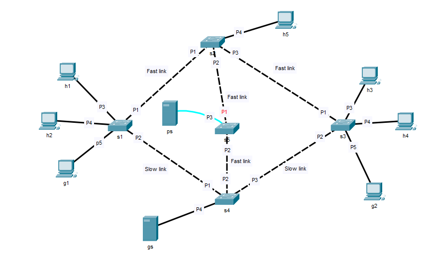

# Networking-2-slicing

## Introduction
The goal of the project is to implement a network slicing to enable dynamic activaton and deactivation of network slicing through both a GUI and CLI, considering the needs of the network. Three slices are implemented (Work, Gaming, Emergency).

The topology is composed by
- 1 SDN controller (c1)
- 5 OpenFlow switches (s1, s2, s3, s4, s5)
- 9 Hosts (h1, h2, h3, h4, h5, ps, g1, g2, gs)

## Project Description
Depending on the mode selected the bandwidth is divided between the slice

```IMPORTANT! A blue linkage means that the host is disconnected from the network```

### Work mode
While in work mode every connection between Gaming and Work is severed, meaning that 
- g1, g2, gs will be connected each other at 100Mbit/sec
- h1-h5 and ps will be connected each other at 1Gbit/sec 


#### Test

Inserire test in work mode (CLI e GUI)

### Gaming mode
While in gaming mode only ps is disconnected from the network, every other hosts is connected with the fast slice



#### Test

Inserire test in gaming mode (CLI e GUI)

### Emergency mode
While in emergency mode only h1-h5 and ps are connected with each other with the fast slice


#### Test

Inserire test in emergency mode (CLI e GUI)

## How to run
1. Connect with a comnetsemu portale or install all the functionalities in your system
2. 
3. Launch the controller 
```$ ryu-manager controller.py```
4. To run the program with the GUI launch
```$ python3 gui.py```
5. Emulate the topology with mininet
```$ sudo python3 topology.py```

### Useful command 
```mininet> dpctl dump-flows``` -> Show all the switches flows
```mininet> h1 ping h2``` (It also works with other hosts) 
```mininet> h1 h2``` -> Verify the bandwidth of the linkage between two hosts (It also works with other hosts) 
```mininet> net``` -> Shows all the hosts
```mininet> ports``` -> Shows all switches and their linkage with the hosts
```mininet> exit``` -> Exit from mininet

## Presentation
[Project presentations]()

## Acknowledgment
Students: [Marco Zanon](https://github.com/marco-zan) - [Giuseppe Ostacchini](https://github.com/beppeosta) - [Luca Checchin](https://github.com/Kayser9)

Project for the course "Networking II - Softwarized and Virtualized Networks" 2022/2023 - [
Fabrizio Granelli](https://webapps.unitn.it/du/it/Persona/PER0003067/Curriculum)


